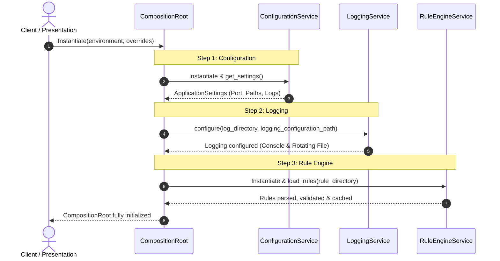

# System Startup Sequence Diagram

```mermaid
sequenceDiagram
    autonumber
    actor Client as Client / Presentation
    participant Root as CompositionRoot
    participant Config as ConfigurationService
    participant Log as LoggingService
    participant Rules as RuleEngineService

    Client->>Root: Instantiate(environment, overrides)
    
    Note over Root, Config: Step 1: Configuration
    Root->>Config: Instantiate & get_settings()
    Config-->>Root: ApplicationSettings (Port, Paths, Logs)

    Note over Root, Log: Step 2: Logging
    Root->>Log: configure(log_directory, logging_configuration_path)
    Log-->>Root: Logging configured (Console & Rotating File)

    Note over Root, Rules: Step 3: Rule Engine
    Root->>Rules: Instantiate & load_rules(rule_directory)
    Rules-->>Root: Rules parsed, validated & cached

    Root-->>Client: CompositionRoot fully initialized
```
