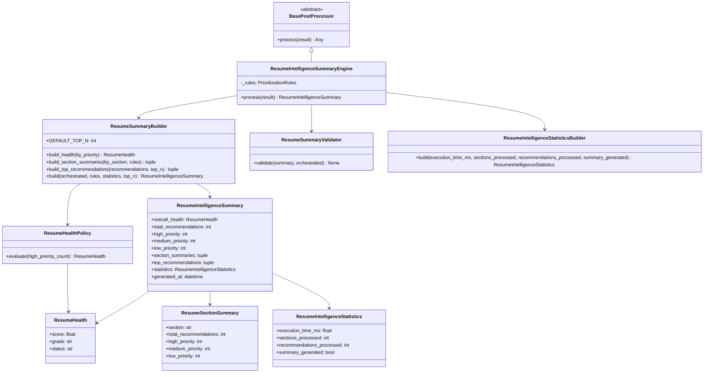

# Summary Class Diagram

```mermaid
classDiagram
    class BasePostProcessor {
        <<abstract>>
        +process(result) Any
    }

    class ResumeIntelligenceSummaryEngine {
        -_rules: PrioritizationRules
        +process(result) ResumeIntelligenceSummary
    }

    class ResumeSummaryBuilder {
        +DEFAULT_TOP_N: int
        +build_health(by_priority) ResumeHealth
        +build_section_summaries(by_section, rules) tuple
        +build_top_recommendations(recommendations, top_n) tuple
        +build(orchestrated, rules, statistics, top_n) ResumeIntelligenceSummary
    }

    class ResumeHealthPolicy {
        +evaluate(high_priority_count) ResumeHealth
    }

    class ResumeSummaryValidator {
        +validate(summary, orchestrated) None
    }

    class ResumeIntelligenceStatisticsBuilder {
        +build(execution_time_ms, sections_processed, recommendations_processed, summary_generated) ResumeIntelligenceStatistics
    }

    class ResumeIntelligenceSummary {
        +overall_health: ResumeHealth
        +total_recommendations: int
        +high_priority: int
        +medium_priority: int
        +low_priority: int
        +section_summaries: tuple
        +top_recommendations: tuple
        +statistics: ResumeIntelligenceStatistics
        +generated_at: datetime
    }

    class ResumeHealth {
        +score: float
        +grade: str
        +status: str
    }

    class ResumeSectionSummary {
        +section: str
        +total_recommendations: int
        +high_priority: int
        +medium_priority: int
        +low_priority: int
    }

    class ResumeIntelligenceStatistics {
        +execution_time_ms: float
        +sections_processed: int
        +recommendations_processed: int
        +summary_generated: bool
    }

    BasePostProcessor <|-- ResumeIntelligenceSummaryEngine
    ResumeIntelligenceSummaryEngine --> ResumeSummaryBuilder
    ResumeIntelligenceSummaryEngine --> ResumeSummaryValidator
    ResumeIntelligenceSummaryEngine --> ResumeIntelligenceStatisticsBuilder
    ResumeSummaryBuilder --> ResumeHealthPolicy
    ResumeSummaryBuilder --> ResumeIntelligenceSummary
    ResumeHealthPolicy --> ResumeHealth
    ResumeIntelligenceSummary --> ResumeHealth
    ResumeIntelligenceSummary --> ResumeSectionSummary
    ResumeIntelligenceSummary --> ResumeIntelligenceStatistics
```
