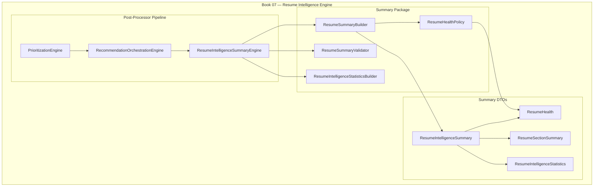

# Summary Component Diagram

```mermaid
graph TB
    subgraph "Book 07 — Resume Intelligence Engine"
        subgraph "Post-Processor Pipeline"
            PE["PrioritizationEngine"]
            OE["RecommendationOrchestrationEngine"]
            SE["ResumeIntelligenceSummaryEngine"]
        end

        subgraph "Summary Package"
            SB["ResumeSummaryBuilder"]
            SV["ResumeSummaryValidator"]
            HP["ResumeHealthPolicy"]
            SSB["ResumeIntelligenceStatisticsBuilder"]
        end

        subgraph "Summary DTOs"
            RIS["ResumeIntelligenceSummary"]
            RH["ResumeHealth"]
            RSS["ResumeSectionSummary"]
            RIST["ResumeIntelligenceStatistics"]
        end
    end

    PE --> OE
    OE --> SE
    SE --> SB
    SE --> SV
    SE --> SSB
    SB --> HP
    SB --> RIS
    HP --> RH
    RIS --> RH
    RIS --> RSS
    RIS --> RIST
```
