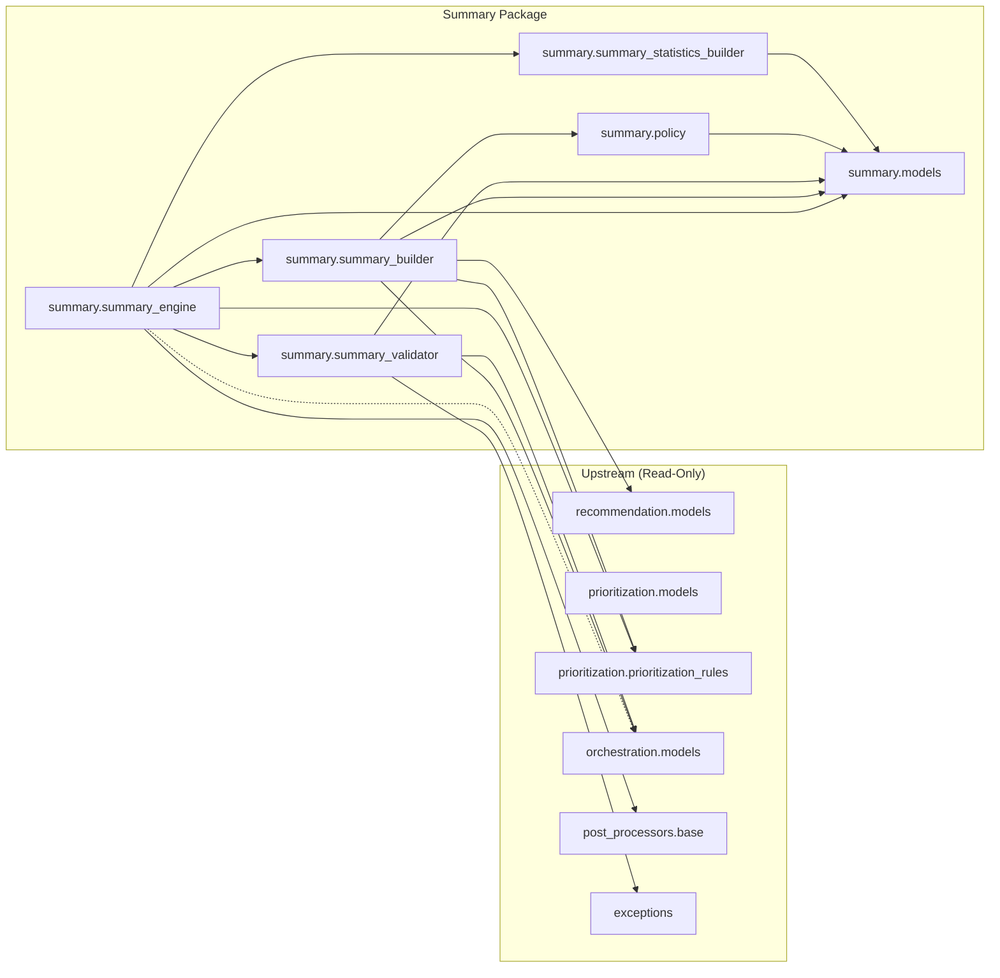

# Summary Dependency Graph

## Dependency Rules

1. `summary.*` depends on `orchestration.models` (input DTO) — read-only.
2. `summary.*` depends on `prioritization.prioritization_rules` (threshold classification) — read-only.
3. `summary.*` depends on `recommendation.models` (Recommendation DTO) — read-only.
4. No upstream package depends on `summary.*`.
5. Only `factory.py` imports `summary.summary_engine` for registration.
