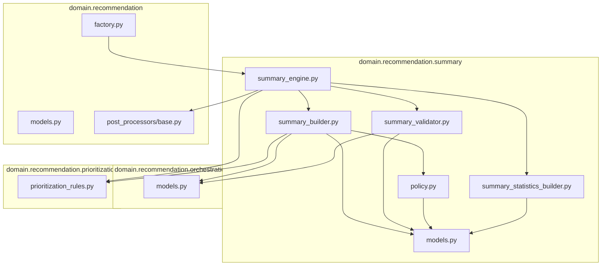

# Summary Package Diagram

```mermaid
graph TB
    subgraph "domain.recommendation.summary"
        models["models.py"]
        policy["policy.py"]
        builder["summary_builder.py"]
        validator["summary_validator.py"]
        stats["summary_statistics_builder.py"]
        engine["summary_engine.py"]
    end

    subgraph "domain.recommendation.orchestration"
        orch_models["models.py"]
    end

    subgraph "domain.recommendation.prioritization"
        pri_rules["prioritization_rules.py"]
    end

    subgraph "domain.recommendation"
        rec_models["models.py"]
        base_pp["post_processors/base.py"]
        factory["factory.py"]
    end

    engine --> base_pp
    engine --> builder
    engine --> validator
    engine --> stats
    engine --> pri_rules
    builder --> policy
    builder --> models
    builder --> orch_models
    builder --> pri_rules
    validator --> models
    validator --> orch_models
    policy --> models
    stats --> models
    factory --> engine
```
