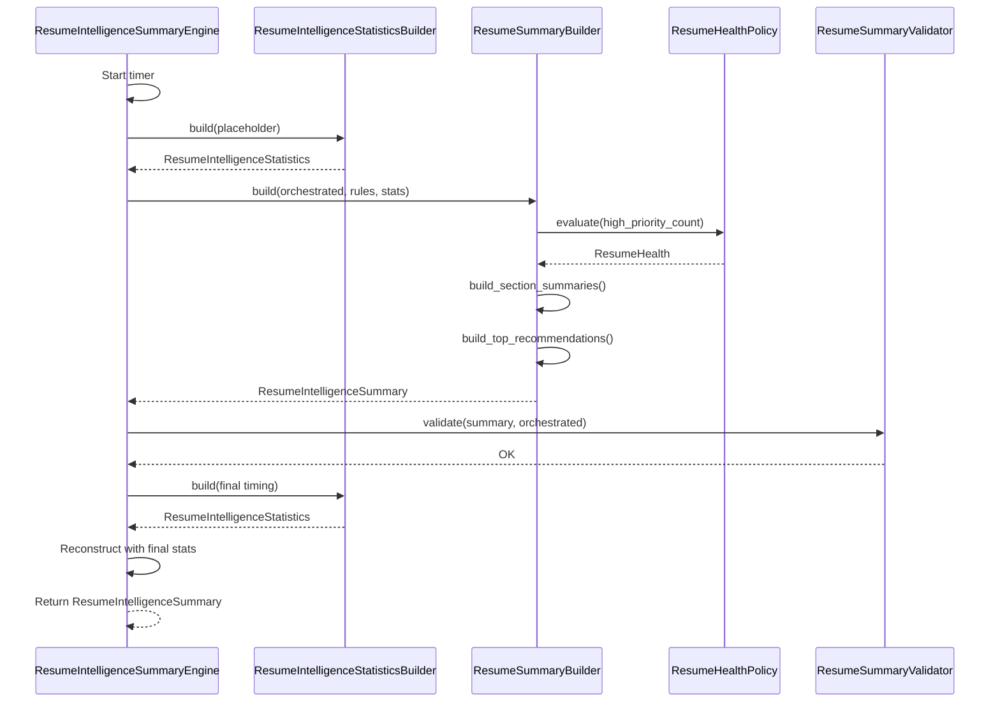

# Summary Sequence Diagram

```mermaid
sequenceDiagram
    participant Engine as ResumeIntelligenceSummaryEngine
    participant Stats as ResumeIntelligenceStatisticsBuilder
    participant Builder as ResumeSummaryBuilder
    participant Policy as ResumeHealthPolicy
    participant Validator as ResumeSummaryValidator

    Engine->>Engine: Start timer
    Engine->>Stats: build(placeholder)
    Stats-->>Engine: ResumeIntelligenceStatistics

    Engine->>Builder: build(orchestrated, rules, stats)
    Builder->>Policy: evaluate(high_priority_count)
    Policy-->>Builder: ResumeHealth
    Builder->>Builder: build_section_summaries()
    Builder->>Builder: build_top_recommendations()
    Builder-->>Engine: ResumeIntelligenceSummary

    Engine->>Validator: validate(summary, orchestrated)
    Validator-->>Engine: OK

    Engine->>Stats: build(final timing)
    Stats-->>Engine: ResumeIntelligenceStatistics

    Engine->>Engine: Reconstruct with final stats
    Engine-->>Engine: Return ResumeIntelligenceSummary
```
